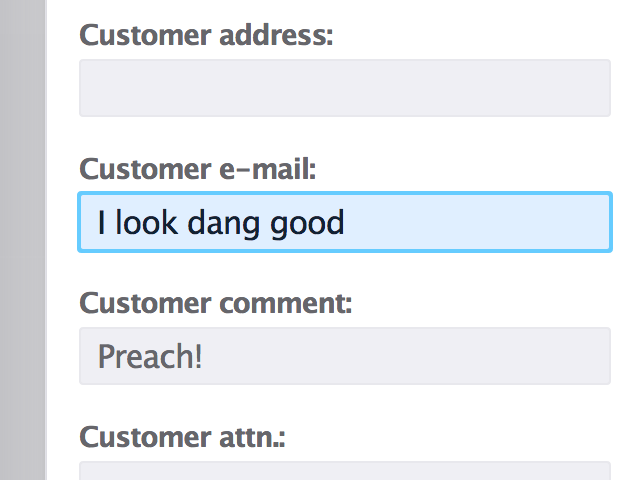
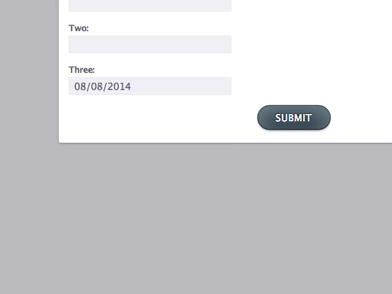

# Swiss-Army Input for React v0.0.22

## Description

The "swissarmy-input-react" module is a ReactJS-component intended to produce useful and nice-looking inputs, complete with labels. The power of "swissarmy-input-react" is that it takes an interchangeable set of properties and takes care of any discrepancies between creating different types of inputs.

It currently supports text-, number-, select- and date-inputs, with more on the horizon.

## Screenshots

## Install

npm install swissarmy-input-react

## Use

	var SwissArmyInput = require('swissarmy-input-react')

	SwissArmyInput(
	    {
	        id          : "myInput",
	        type        : "number",
	        className   : "anInput",
	        labelText   : "My input:",
	        placeholder : "Type here...",
	        value       : "I'm a hot mess!",
	        maxLength   : "23"
	    }
	)

The properties map to corresponding attributes of the `input`- or `label`-elements, but provide extended functionality in the case of the `type`-property:

The `type`-property will normally pass a string value to the `type`-attribute of the `input`-element, but if passed value is `"date"` or `"select"`, then a datepicker-/select box-widget is initialized instead.

## Todo

* Live indicator for remaining characters (if `maxLength`-value is provided)
* Support more input-types
* Support for specifying date-format
